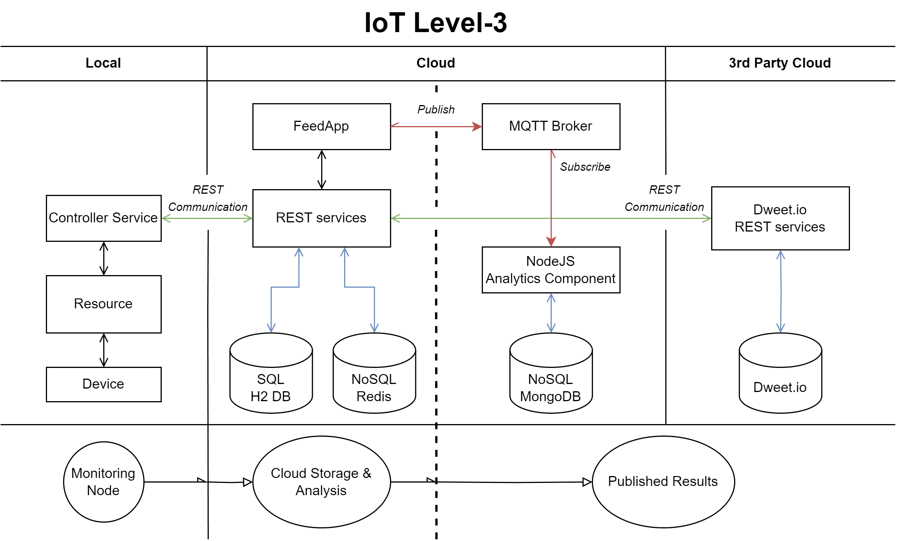

# Dat250Project

This repo contains a Poll-system application, that lets users create polls and vote on polls made by other users.  

Link to front end of the application: https://github.com/MikalDr/Dat250project-frontend  

Below is some of the diagrams created during the planning stage of the project:
### Application flow diagram

### AoT

### Database Diagram
.png?raw=true)
### Use cases

### UI demo

 
